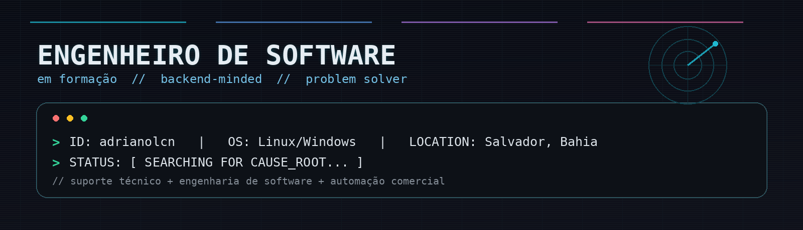
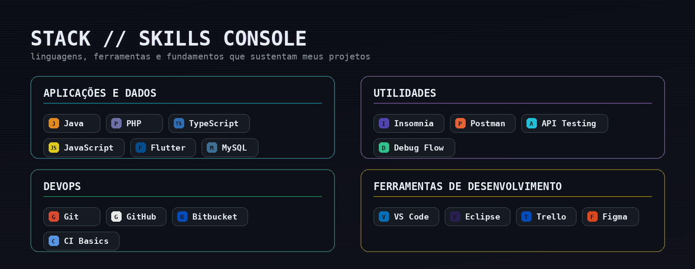
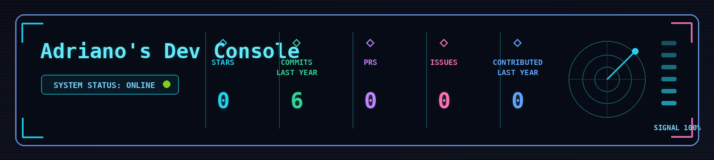

<div align="center">



<br />

[](https://git.io/typing-svg)

</div>

---

## Sobre mim

Sou graduando em **Engenharia de Software** pela **Universidade Católica do Salvador (UCSal)** e trabalho como **Técnico de Suporte na POS CONTROLE**, atuando no contato direto com sistemas, regras de negócio, troubleshooting e automação comercial.

Minha transição para desenvolvimento nasce dessa prática: entender problemas reais, investigar causa raiz, organizar soluções e transformar operação em software mais claro, confiável e útil.

```text
ID: adrianolcn  |  OS: Linux/Windows  |  LOCATION: Salvador/BA
----------------------------------------------------------------
STATUS: [ SEARCHING FOR CAUSE_ROOT... ]
FOCUS : [ BACKEND · DATA STRUCTURES · REQUIREMENTS · QUALITY ]
```

- Explorando novas tecnologias e desenvolvendo soluções de software.
- Estudando fundamentos sólidos de Ciência da Computação e Engenharia de Software.
- Aplicando visão de suporte técnico, automação comercial e experiência do usuário em projetos reais.
- Evoluindo em backend, arquitetura, testes, banco de dados e qualidade de software.

---

## Stack principal



<div align="center">


</div>

---

## Projetos em destaque

| Projeto | Foco | Stack / destaque |
|---|---|---|
| [**AED·Studio**](https://github.com/adrianolcn/aed-studio) | Plataforma educacional full-stack para Algoritmos e Estruturas de Dados | Java 17, Spring Boot, JWT, PostgreSQL/Flyway, Playwright |
| [**SORT//VIS**](https://github.com/adrianolcn/sortvis) | Laboratório visual retrô para algoritmos de ordenação | HTML, CSS, JavaScript, Canvas, i18n EN/PT-BR, Playwright |
| [**AURA**](https://github.com/adrianolcn/aura) | Plataforma de gestão para profissionais de beleza | TypeScript, Next.js, React, Expo, Supabase, automações |

---

## GitHub telemetry



<div align="center">


</div>

---

## Onde me encontrar

<div align="center">

[](https://www.linkedin.com/in/adriano-nunes-683a84119/)
[](mailto:adrianoconunes@gmail.com)
[](https://github.com/adrianolcn)

</div>

---

<div align="center">


</div>
